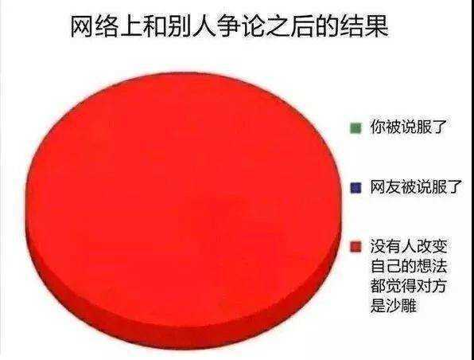

对个人而言，如果不是为了流量，那么在任何互联网的争论，都毫无意义。

在网上争论了一年的总结：

- 是想说服对方吗？可惜改变之门是由内打开的，你怎么通过几KB的语言去撬开这扇门？这扇门背后，可能是别人几百TB的个人经历；
- 对方是“人”吗？不只是说对方可能是机器人，还是说，人到了互联网上，会异化成另一种，“东西”；
- 谁主持的争论？互联网几乎都是无人主持的争论，就是说，就算理亏的一方，也能想办法“赖”，后面要比的，可能是脸皮厚度、“先发优势”与粉丝数量；
- 假设对方做了个人，也算讲道理，还有人主持，然后花时间最多的地方是“对齐概念的理解”
- ……

如果对方不是你儿女，那么应该没必要教会对方那么多吧？

假如有个网络账号对你说，它养的所有猪都会飞，以此为前提的所有推论，你都可以认为在逻辑上正确 —— 逻辑上，根本没有争辩的必要，因为在逻辑上，假设是错的话，推论为真。

<!--TODO: 记一些争论-->

如果认识了这些，但还想着“为肮脏的语言环境舔一些清水”，那么就顺着内心去做吧，对你而言，做这件事本身，就是一切的意义。